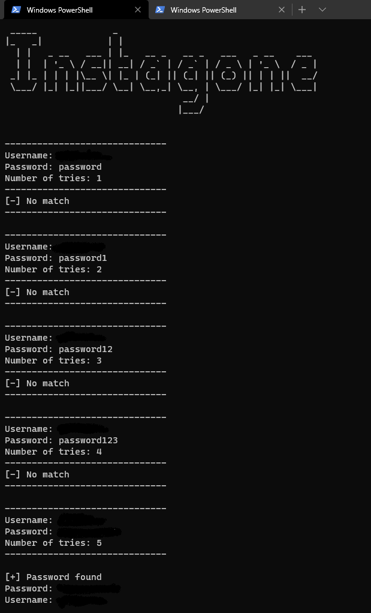

# Instagone

This is a dictionary attack for instagram, using Python.




# Libraries
```pip install -r requirements.txt ```
 
# Proxy (tor)
If you would like to use the script, with a proxy, you will need to setup TOR. Here is a good tutorial for setting it up: 
https://miloserdov.org/?p=1839
 

# Usage 
 ``` 
 Usage: instagone.py [-u] username [-l] passwordlist

    REQUIRED:
        -u or --username: 
          The username of the victim
        #######################################
        -l or --list: 
          The password list to be used 

    HELP:
        -h or --help:
          Displays this menu
          
```
